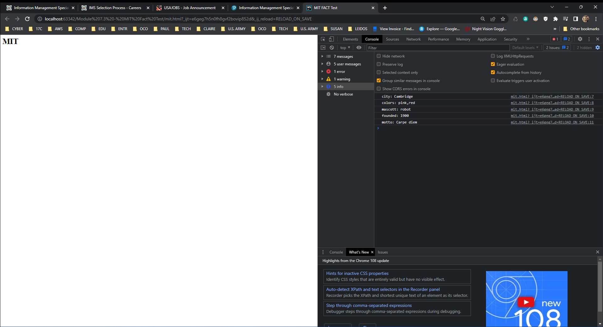
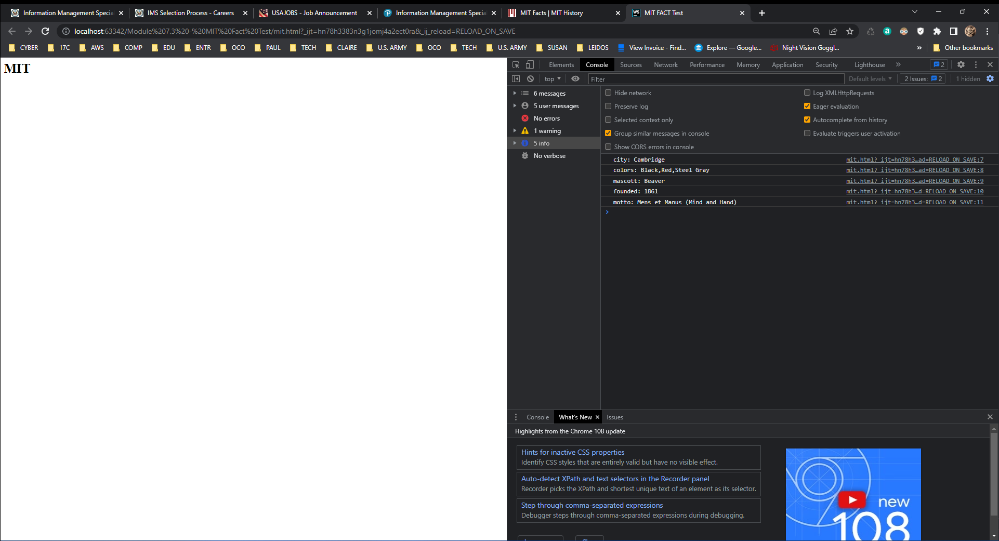

# mitfacts
MIT Facts

knowing the html file ```mit.html```

```html
<script src="mit.js"></script>

<title>MIT FACT Test</title>
<h1>MIT</h1>

<script>
    console.log('city: ' + mit.city);
    console.log('colors: ' + mit.colors);
    console.log('mascott: ' + mit.mascot);
    console.log('founded: ' + mit.founded);
    console.log('motto: ' + mit.motto);
</script>
```

Before Correcting html page shows



After Correcting html page shows



Before Correcting ```mit.js```

```javascript
var mit = {
    city: 'Cambridge',
    colors: ['pink', 'red'],
    mascot: "robot",
    founded: 1900,
    motto: 'Carpe diem',
};
```
After Correcting ```mit.js```

```javascript
var mit = {
    city: 'Cambridge',
    colors: ['Black', 'Red', 'Steel Gray'],
    mascot: "Beaver",
    founded: 1861,
    motto: 'Mens et Manus (Mind and Hand)',
};
```

Before Correcting ```mit.test.js```

```javascript
var utils  = require('course-utilities');
var mit = utils.load('./mit.js', 'mit');

describe('MIT', () => {

    test('Object properties present', () => {
        expect(mit).toHaveProperty('city');
        expect(mit).toHaveProperty('colors');
        expect(mit).toHaveProperty('mascot');
    });

    test('City match', () => {
        expect(mit.city).toBe('Cambridge');
    });

    test('Colors match', () => {
        expect(mit.colors).toContain('Silver Gray');    
    });

    test('Founded range', () => {
        expect(mit.founded).toBeLessThanOrEqual(1875);
        expect(mit.founded).toBeGreaterThanOrEqual(1850);    
    });

    test('Motto', () => {
        expect(mit.motto).toMatch('Mens');
    });
});
```

After correcting ```mit.test.js```
```javascript
var utils  = require('course-utilities');
var mit = utils.load('./mit.js', 'mit');

describe('MIT', () => {

    test('Object properties present', () => {
        expect(mit).toHaveProperty('city');
        expect(mit).toHaveProperty('colors');
        expect(mit).toHaveProperty('mascot');
    });

    test('City match', () => {
        expect(mit.city).toBe('Cambridge');
    });

    test('Colors match', () => {
        expect(mit.colors).toContain('Steel Gray');
    });

    test('Founded range', () => {
        expect(mit.founded).toBeLessThanOrEqual(1875);
        expect(mit.founded).toBeGreaterThanOrEqual(1850);    
    });

    test('Motto', () => {
        expect(mit.motto).toMatch('Mens et Manus (Mind and Hand)');
    });
});
```